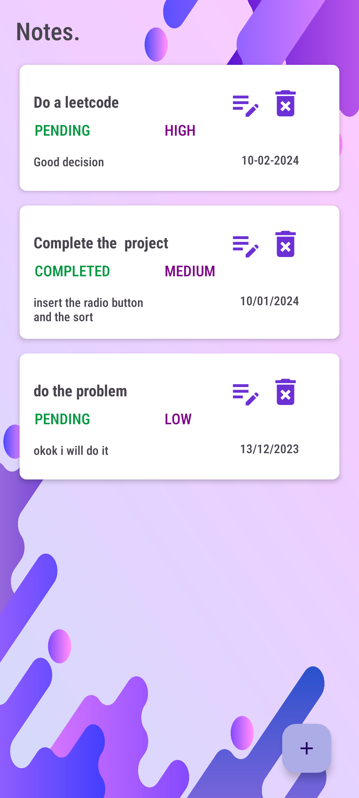
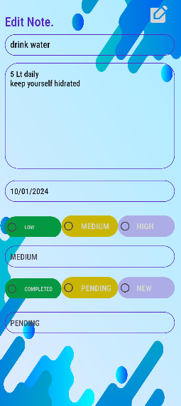
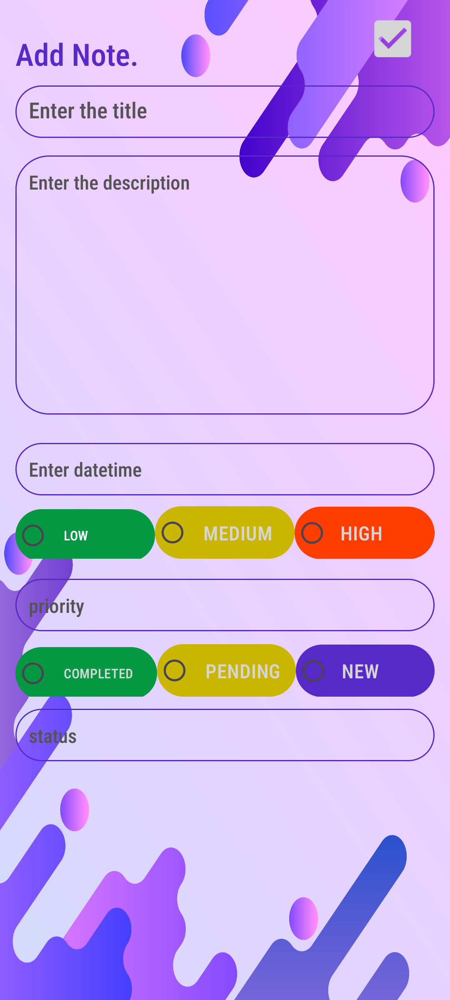

# Todo-List Android App

## Overview

Welcome to the Todo-List Android app! This app allows users to manage their tasks efficiently with features such as due dates, priority levels, task statuses, titles, and descriptions.

## Key Features

### 1. Task Management
- **Due Date:** Assign due dates to tasks for better organization.
- **Priority Levels:** Categorize tasks as Low, Medium, or High based on their importance.
- **Task Status:** Track task progress with statuses like New, In Progress, or Completed.
- **Title and Description:** Provide quick identification and detailed information for each task.

### 2. Local Storage
The app utilizes local storage to save tasks, leveraging SQLite for efficient and reliable data storage.

## Technology Stack

- **Language:** Kotlin
- **Database:** SQLite

## Getting Started

Follow these steps to run the Todo-List Android app:

1. Clone the repository:
   ```bash
   git clone https://github.com/shashank1325/Todo-Manager.git
   
2.Open the project in Android Studio.

3.Build and run the app on an emulator or physical device.

4.Make sure to include the SQLite library in your app.
   - implementation 'com.readystatesoftware.sqliteasset:sqliteassethelper:+'

## Image Gallery

### Image 1:Dashboard


### Image 2: Editing page for the todo



### Image 3:AddTodo



